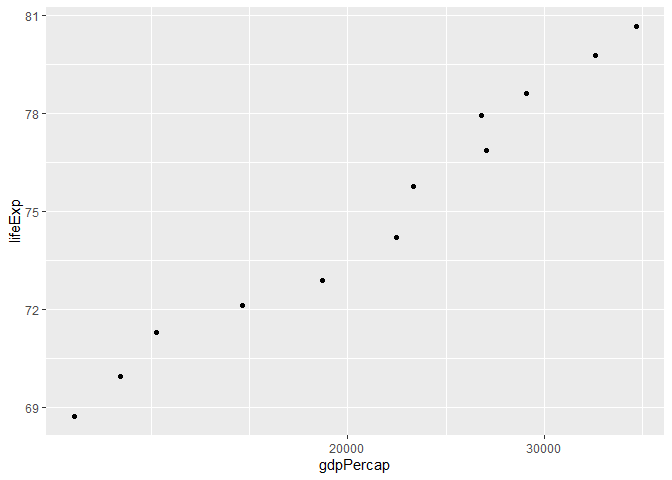
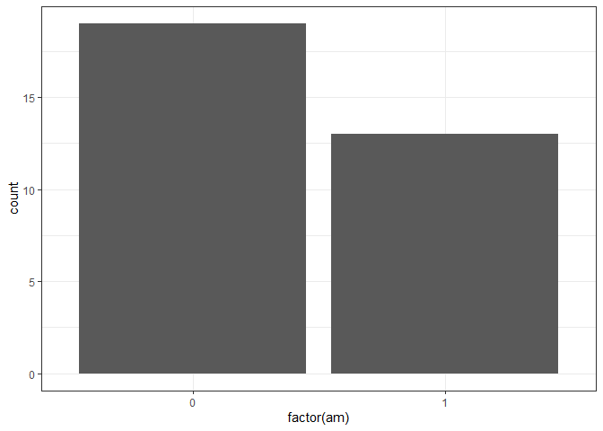
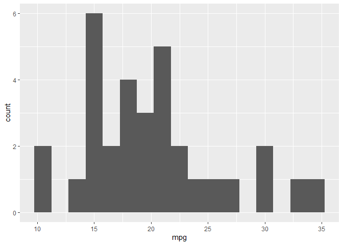
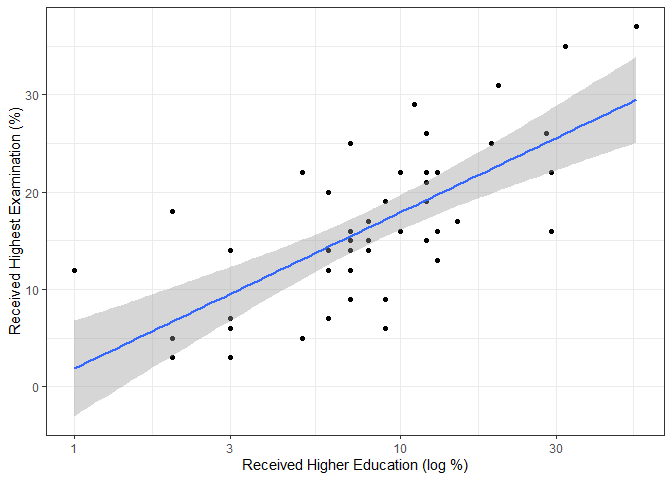
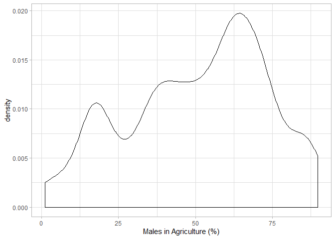

 
# Objective
_The goal is to get your feet wet with `ggplot2` and `dplyr` to explore a dataset._
  
Setup:

```r
suppressPackageStartupMessages(library(gapminder))
suppressPackageStartupMessages(library(tidyverse))
suppressPackageStartupMessages(library(tsibble))
```
  
## Exercise 1: Basic `dplyr`
  
### 1.1:
_Use `filter()` to subset the gapminder data to three countries of your choice in the 1970’s_


```r
subminder<-gapminder %>% 
  filter(year == 1970:1979) %>% 
  filter(country == 'Albania' | country == 'Brazil' | country == 'China')
```

```
## Warning in year == 1970:1979: longer object length is not a multiple of shorter
## object length
```

```r
subminder %>% 
    knitr::kable()
```


country   continent    year    lifeExp         pop   gdpPercap
--------  ----------  -----  ---------  ----------  ----------
Albania   Europe       1977   68.93000     2509048   3533.0039
Brazil    Americas     1972   59.50400   100840058   4985.7115
China     Asia         1972   63.11888   862030000    676.9001
  
### 1.2
_Use the pipe operator `%>%` to select “country” and “gdpPercap” from your filtered dataset in 1.1._


```r
subminder %>% 
  select(country,gdpPercap) %>% 
  knitr::kable()
```


country    gdpPercap
--------  ----------
Albania    3533.0039
Brazil     4985.7115
China       676.9001
  
### 1.3
_Filter `gapminder` to all entries that have experienced a drop in life expectancy. Be sure to include a new variable that’s the increase in life expectancy in your tibble. Hint: you might find the `lag()` or `diff()` functions useful._


```r
gapminder %>% 
  group_by(country) %>% 
  arrange(year) %>% 
  mutate(change_lifeExp = difference(lifeExp, lag = 1)) %>% 
  filter(change_lifeExp < 0) %>% 
  DT::datatable()
```

<!--html_preserve--><div id="htmlwidget-391df5cc7a812f88d7d8" style="width:100%;height:auto;" class="datatables html-widget"></div>
<script type="application/json" data-for="htmlwidget-391df5cc7a812f88d7d8">{"x":{"filter":"none","data":[["1","2","3","4","5","6","7","8","9","10","11","12","13","14","15","16","17","18","19","20","21","22","23","24","25","26","27","28","29","30","31","32","33","34","35","36","37","38","39","40","41","42","43","44","45","46","47","48","49","50","51","52","53","54","55","56","57","58","59","60","61","62","63","64","65","66","67","68","69","70","71","72","73","74","75","76","77","78","79","80","81","82","83","84","85","86","87","88","89","90","91","92","93","94","95","96","97","98","99","100","101","102"],["China","Cambodia","Czech Republic","Netherlands","Slovak Republic","Bulgaria","Cambodia","El Salvador","Poland","Uganda","Congo, Dem. Rep.","Croatia","Denmark","El Salvador","Eritrea","Hungary","Serbia","Uganda","Angola","Congo, Dem. Rep.","Norway","Poland","Romania","Rwanda","Zambia","Albania","Botswana","Bulgaria","Burundi","Cameroon","Central African Republic","Congo, Dem. Rep.","Congo, Rep.","Cote d'Ivoire","Hungary","Iraq","Jamaica","Kenya","Korea, Dem. Rep.","Liberia","Puerto Rico","Romania","Rwanda","Sierra Leone","Somalia","Tanzania","Uganda","Zambia","Zimbabwe","Botswana","Bulgaria","Cameroon","Central African Republic","Chad","Congo, Dem. Rep.","Congo, Rep.","Cote d'Ivoire","Gabon","Iraq","Kenya","Korea, Dem. Rep.","Lesotho","Malawi","Namibia","Nigeria","South Africa","Swaziland","Tanzania","Trinidad and Tobago","Uganda","Zambia","Zimbabwe","Benin","Botswana","Cameroon","Central African Republic","Chad","Cote d'Ivoire","Gabon","Ghana","Iraq","Jamaica","Kenya","Korea, Dem. Rep.","Lesotho","Malawi","Montenegro","Mozambique","Myanmar","Namibia","Nigeria","South Africa","Swaziland","Togo","Trinidad and Tobago","Zambia","Zimbabwe","Gabon","Lesotho","Mozambique","South Africa","Swaziland"],["Asia","Asia","Europe","Europe","Europe","Europe","Asia","Americas","Europe","Africa","Africa","Europe","Europe","Americas","Africa","Europe","Europe","Africa","Africa","Africa","Europe","Europe","Europe","Africa","Africa","Europe","Africa","Europe","Africa","Africa","Africa","Africa","Africa","Africa","Europe","Asia","Americas","Africa","Asia","Africa","Americas","Europe","Africa","Africa","Africa","Africa","Africa","Africa","Africa","Africa","Europe","Africa","Africa","Africa","Africa","Africa","Africa","Africa","Asia","Africa","Asia","Africa","Africa","Africa","Africa","Africa","Africa","Africa","Americas","Africa","Africa","Africa","Africa","Africa","Africa","Africa","Africa","Africa","Africa","Africa","Asia","Americas","Africa","Asia","Africa","Africa","Europe","Africa","Asia","Africa","Africa","Africa","Africa","Africa","Americas","Africa","Africa","Africa","Africa","Africa","Africa","Africa"],[1962,1972,1972,1972,1972,1977,1977,1977,1977,1977,1982,1982,1982,1982,1982,1982,1982,1982,1987,1987,1987,1987,1987,1987,1987,1992,1992,1992,1992,1992,1992,1992,1992,1992,1992,1992,1992,1992,1992,1992,1992,1992,1992,1992,1992,1992,1992,1992,1992,1997,1997,1997,1997,1997,1997,1997,1997,1997,1997,1997,1997,1997,1997,1997,1997,1997,1997,1997,1997,1997,1997,1997,2002,2002,2002,2002,2002,2002,2002,2002,2002,2002,2002,2002,2002,2002,2002,2002,2002,2002,2002,2002,2002,2002,2002,2002,2002,2007,2007,2007,2007,2007],[44.50136,40.317,70.29,73.75,70.35,70.81,31.22,56.696,70.67,50.35,47.784,70.46,74.63,56.604,43.89,69.39,70.162,49.849,39.906,47.412,75.89,70.98,69.53,44.02,50.821,71.581,62.745,71.19,44.736,54.314,49.396,45.548,56.433,52.044,69.17,59.461,71.766,59.285,69.978,40.802,73.911,69.36,23.599,38.333,39.658,50.44,48.825,46.1,60.377,52.556,70.32,52.199,46.066,51.573,42.587,52.962,47.991,60.461,58.811,54.407,67.727,55.558,47.495,58.909,47.464,60.236,54.289,48.466,69.465,44.578,40.238,46.809,54.406,46.634,49.856,43.308,50.525,46.832,56.761,58.453,57.046,72.047,50.992,66.662,44.593,45.009,73.981,44.026,59.908,51.479,46.608,53.365,43.869,57.561,68.976,39.193,39.989,56.735,42.592,42.082,49.339,39.613],[665770000,7450606,9862158,13329874,4593433,8797022,6978607,4282586,34621254,11457758,30646495,4413368,5117810,4474873,2637297,10705535,9032824,12939400,7874230,35481645,4186147,37740710,22686371,6349365,7272406,3326498,1342614,8658506,5809236,12467171,3265124,41672143,2409073,12772596,10348684,17861905,2378618,25020539,20711375,1912974,3585176,22797027,7290203,4260884,6099799,26605473,18252190,8381163,10704340,1536536,8066057,14195809,3696513,7562011,47798986,2800947,14625967,1126189,20775703,28263827,21585105,1982823,10419991,1774766,106207839,42835005,1054486,30686889,1138101,21210254,9417789,11404948,7026113,1630347,15929988,4048013,8835739,16252726,1299304,20550751,24001816,2664659,31386842,22215365,2046772,11824495,720230,18473780,45598081,1972153,119901274,44433622,1130269,4977378,1101832,10595811,11926563,1454867,2012649,19951656,43997828,1133066],[487.6740183,421.6240257,13108.4536,18794.74567,9674.167626,7612.240438,524.9721832,5138.922374,9508.141454,843.7331372,673.7478181,13221.82184,21688.04048,4098.344175,524.8758493,12545.99066,15181.0927,682.2662268,2430.208311,672.774812,31540.9748,9082.351172,9696.273295,847.991217,1213.315116,2497.437901,7954.111645,6302.623438,631.6998778,1793.163278,747.9055252,457.7191807,4016.239529,1648.073791,10535.62855,3745.640687,7404.923685,1341.921721,3726.063507,636.6229191,14641.58711,6598.409903,737.0685949,1068.696278,926.9602964,825.682454,644.1707969,1210.884633,693.4207856,8647.142313,5970.38876,1694.337469,740.5063317,1004.961353,312.188423,3484.164376,1786.265407,14722.84188,3076.239795,1360.485021,1690.756814,1186.147994,692.2758103,3899.52426,1624.941275,7479.188244,3876.76846,789.1862231,8792.573126,816.559081,1071.353818,792.4499603,1372.877931,11003.60508,1934.011449,738.6906068,1156.18186,1648.800823,12521.71392,1111.984578,4390.717312,6994.774861,1287.514732,1646.758151,1275.184575,665.4231186,6557.194282,633.6179466,611,4072.324751,1615.286395,7710.946444,4128.116943,886.2205765,11460.60023,1071.613938,672.0386227,13206.48452,1569.331442,823.6856205,9269.657808,4513.480643],[-6.0476,-5.098,-0.0899999999999892,-0.0699999999999932,-0.63000000000001,-0.0900000000000034,-9.097,-1.511,-0.179999999999993,-0.665999999999997,-0.0200000000000031,-0.180000000000007,-0.0600000000000023,-0.0919999999999987,-0.644999999999996,-0.560000000000002,-0.137999999999991,-0.501000000000005,-0.0360000000000014,-0.372,-0.0799999999999983,-0.339999999999989,-0.129999999999995,-2.198,-1,-0.418999999999997,-0.877000000000002,-0.150000000000006,-3.475,-0.670999999999999,-1.089,-1.864,-1.037,-2.611,-0.409999999999997,-5.583,-0.00399999999999068,-0.054000000000002,-0.669000000000011,-5.225,-0.718999999999994,-0.170000000000002,-20.421,-1.673,-4.843,-1.095,-2.684,-4.721,-1.974,-10.189,-0.870000000000005,-2.115,-3.33,-0.150999999999996,-2.961,-3.471,-4.053,-0.905000000000001,-0.649999999999999,-4.878,-2.25099999999999,-4.127,-1.925,-3.09,-0.00800000000000267,-1.652,-4.185,-1.974,-0.396999999999991,-4.247,-5.862,-13.568,-0.371000000000002,-5.922,-2.343,-2.758,-1.048,-1.159,-3.7,-0.102999999999994,-1.765,-0.215000000000003,-3.415,-1.065,-10.965,-2.486,-1.464,-2.318,-0.420000000000002,-7.43,-0.856000000000002,-6.871,-10.42,-0.829000000000001,-0.489000000000004,-1.045,-6.82,-0.0260000000000034,-2.001,-1.944,-4.026,-4.256]],"container":"<table class=\"display\">\n  <thead>\n    <tr>\n      <th> <\/th>\n      <th>country<\/th>\n      <th>continent<\/th>\n      <th>year<\/th>\n      <th>lifeExp<\/th>\n      <th>pop<\/th>\n      <th>gdpPercap<\/th>\n      <th>change_lifeExp<\/th>\n    <\/tr>\n  <\/thead>\n<\/table>","options":{"columnDefs":[{"className":"dt-right","targets":[3,4,5,6,7]},{"orderable":false,"targets":0}],"order":[],"autoWidth":false,"orderClasses":false}},"evals":[],"jsHooks":[]}</script><!--/html_preserve-->

```r
#I'm having an issue with `diff()`, because the output of change_lifeExp is 1 value shorter than the rest of the table (there's no value for the first year, I'm assuming, and it doesn't allow N/A).  `difference()` from tsibble overcomes that, but I don't know how to do this the "correct" way.
```
  
### 1.4
_Choose one of the following:_

[x]Filter `gapminder` so that it shows the max GDP per capita experienced by each country. Hint: you might find the `max()` function useful here.
  
[ ]Filter `gapminder` to contain six rows: the rows with the three largest GDP per capita, and the rows with the three smallest GDP per capita. Be sure to not create any intermediate objects when doing this (with, for example, the assignment operator).  Hint: you might find the `sort()` function useful, or perhaps even the `dplyr::slice()` function.


```r
gapminder %>% 
  group_by(country) %>% 
  summarise(max(gdpPercap)) %>% 
  DT::datatable()
```

<!--html_preserve--><div id="htmlwidget-2f730740a216c7a79091" style="width:100%;height:auto;" class="datatables html-widget"></div>
<script type="application/json" data-for="htmlwidget-2f730740a216c7a79091">{"x":{"filter":"none","data":[["1","2","3","4","5","6","7","8","9","10","11","12","13","14","15","16","17","18","19","20","21","22","23","24","25","26","27","28","29","30","31","32","33","34","35","36","37","38","39","40","41","42","43","44","45","46","47","48","49","50","51","52","53","54","55","56","57","58","59","60","61","62","63","64","65","66","67","68","69","70","71","72","73","74","75","76","77","78","79","80","81","82","83","84","85","86","87","88","89","90","91","92","93","94","95","96","97","98","99","100","101","102","103","104","105","106","107","108","109","110","111","112","113","114","115","116","117","118","119","120","121","122","123","124","125","126","127","128","129","130","131","132","133","134","135","136","137","138","139","140","141","142"],["Afghanistan","Albania","Algeria","Angola","Argentina","Australia","Austria","Bahrain","Bangladesh","Belgium","Benin","Bolivia","Bosnia and Herzegovina","Botswana","Brazil","Bulgaria","Burkina Faso","Burundi","Cambodia","Cameroon","Canada","Central African Republic","Chad","Chile","China","Colombia","Comoros","Congo, Dem. Rep.","Congo, Rep.","Costa Rica","Cote d'Ivoire","Croatia","Cuba","Czech Republic","Denmark","Djibouti","Dominican Republic","Ecuador","Egypt","El Salvador","Equatorial Guinea","Eritrea","Ethiopia","Finland","France","Gabon","Gambia","Germany","Ghana","Greece","Guatemala","Guinea","Guinea-Bissau","Haiti","Honduras","Hong Kong, China","Hungary","Iceland","India","Indonesia","Iran","Iraq","Ireland","Israel","Italy","Jamaica","Japan","Jordan","Kenya","Korea, Dem. Rep.","Korea, Rep.","Kuwait","Lebanon","Lesotho","Liberia","Libya","Madagascar","Malawi","Malaysia","Mali","Mauritania","Mauritius","Mexico","Mongolia","Montenegro","Morocco","Mozambique","Myanmar","Namibia","Nepal","Netherlands","New Zealand","Nicaragua","Niger","Nigeria","Norway","Oman","Pakistan","Panama","Paraguay","Peru","Philippines","Poland","Portugal","Puerto Rico","Reunion","Romania","Rwanda","Sao Tome and Principe","Saudi Arabia","Senegal","Serbia","Sierra Leone","Singapore","Slovak Republic","Slovenia","Somalia","South Africa","Spain","Sri Lanka","Sudan","Swaziland","Sweden","Switzerland","Syria","Taiwan","Tanzania","Thailand","Togo","Trinidad and Tobago","Tunisia","Turkey","Uganda","United Kingdom","United States","Uruguay","Venezuela","Vietnam","West Bank and Gaza","Yemen, Rep.","Zambia","Zimbabwe"],[978.0114388,5937.029526,6223.367465,5522.776375,12779.37964,34435.36744,36126.4927,29796.04834,1391.253792,33692.60508,1441.284873,3822.137084,7446.298803,12569.85177,9065.800825,10680.79282,1217.032994,631.6998778,1713.778686,2602.664206,36319.23501,1193.068753,1704.063724,13171.63885,4959.114854,7006.580419,1937.577675,905.8602303,4879.507522,9645.06142,2602.710169,14619.22272,8948.102923,22833.30851,35278.41874,3694.212352,6025.374752,7429.455877,5581.180998,5728.353514,12154.08975,913.47079,690.8055759,33207.0844,30470.0167,21745.57328,884.7552507,32170.37442,1327.60891,27538.41188,5186.050003,945.5835837,838.1239671,2011.159549,3548.330846,39724.97867,18008.94444,36180.78919,2452.210407,3540.651564,11888.59508,14688.23507,40675.99635,25523.2771,28569.7197,7433.889293,31656.06806,4519.461171,1463.249282,4106.525293,23348.13973,113523.1329,10461.05868,1569.331442,803.0054535,21951.21176,1748.562982,759.3499101,12451.6558,1042.581557,1803.151496,10956.99112,11977.57496,3095.772271,11732.51017,3820.17523,823.6856205,944,4811.060429,1091.359778,36797.93332,25185.00911,5486.371089,1054.384891,2013.977305,49357.19017,22316.19287,2605.94758,9809.185636,4258.503604,7408.905561,3190.481016,15389.92468,20509.64777,19328.70901,7670.122558,10808.47561,881.5706467,1890.218117,34167.7626,1712.472136,15870.87851,1465.010784,47143.17964,18678.31435,25768.25759,1450.992513,9269.657808,28821.0637,3970.095407,2602.394995,4513.480643,33859.74835,37506.41907,4184.548089,28718.27684,1107.482182,7458.396327,1649.660188,18008.50924,7092.923025,8458.276384,1056.380121,33203.26128,42951.65309,10611.46299,13143.95095,2441.576404,7110.667619,2280.769906,1777.077318,799.3621758]],"container":"<table class=\"display\">\n  <thead>\n    <tr>\n      <th> <\/th>\n      <th>country<\/th>\n      <th>max(gdpPercap)<\/th>\n    <\/tr>\n  <\/thead>\n<\/table>","options":{"columnDefs":[{"className":"dt-right","targets":2},{"orderable":false,"targets":0}],"order":[],"autoWidth":false,"orderClasses":false}},"evals":[],"jsHooks":[]}</script><!--/html_preserve-->

### 1.5
_Produce a scatterplot of Canada’s life expectancy vs. GDP per capita using `ggplot2`, without defining a new variable. That is, after filtering the `gapminder` data set, pipe it directly into the `ggplot()` function. Ensure GDP per capita is on a log scale._


```r
gapminder %>% 
  filter(country == 'Canada') %>% 
  ggplot(aes(gdpPercap,lifeExp)) +
  geom_point() +
  scale_x_log10()
```

<!-- -->
  
## Exercise 2: Explore individual variables with `dplyr`
  
_Pick one categorical variable and one quantitative variable to explore. Answer the following questions in whichever way you think is appropriate, using `dplyr`:_

* What are the possible values (or range, whichever is appropriate) of each variable?
* What values are typical? What’s the spread? What’s the distribution? Etc., tailored to the variable at hand.
* Feel free to use summary stats, tables, figures.
  
__Dataset: mtcars.  Categorical variable: am.  Quantitative variable: mpg__
  

There are two possible levels for the categorical variable "am": 0 (19 observations) and 1 (13 observations).  This dataset has a total of 32 observations.
  

<!-- -->

The quantitative variable "mpg" is slightly more complex.  It ranges from 10.4 to 33.9, with an average of 20.090625 and a standard deviation of 6.0269481.  A basic idea of the shape of this variable's distribution can be seen below:

<!-- -->


## Exercise 3: Explore various plot types 
_Make two plots that have some value to them. That is, plots that someone might actually consider making for an analysis. Just don’t make the same plots we made in class—feel free to use a data set from the `datasets` R package or any other source if you wish._

1. A scatterplot of two quantitative variables.
2. One other plot besides a scatterplot.

_You don’t have to use all the data in every plot! It’s fine to filter down to one group or country or a small handful of groups/countries._

The `swiss` dataset population information on 47 provinces of Switzerland in 1888.  By province, variables include the % of males employed in the agricultural sector, the % of army draftees who received the best score on their entrance exam, along with the % of army draftees who had higher education, along with 3 other variables.

An idea of the correlation between the percentage of draftees with the best entrance scores and the percentage of draftees who completed additional education in each province can be gathered from the scatterplot below (note the use of a log scale on the x-axis for clarity).

<!-- -->

An overview of the distribution of males employed in the agricultural sector across the different provinces can be seen in the barchart below.

<!-- -->


## Recycling (Optional)
_Evaluate this code and describe the result. Presumably the analyst’s intent was to get the data for Rwanda and Afghanistan. Did they succeed? Why or why not? If not, what is the correct way to do this?_

`filter(gapminder, country == c("Rwanda", "Afghanistan"))`

The above code does filter out the data for Rwanda and Afghanistan, producing the tibble below that includes all variables for only those two countries.  Another method of reaching this same result is `filter(gapminder, country == "Rwanda" | country == "Afghanistan")`.  Note that neither code saves the filtered dataset.

<!--html_preserve--><div id="htmlwidget-61c820781a0e415a499d" style="width:100%;height:auto;" class="datatables html-widget"></div>
<script type="application/json" data-for="htmlwidget-61c820781a0e415a499d">{"x":{"filter":"none","data":[["1","2","3","4","5","6","7","8","9","10","11","12"],["Afghanistan","Afghanistan","Afghanistan","Afghanistan","Afghanistan","Afghanistan","Rwanda","Rwanda","Rwanda","Rwanda","Rwanda","Rwanda"],["Asia","Asia","Asia","Asia","Asia","Asia","Africa","Africa","Africa","Africa","Africa","Africa"],[1957,1967,1977,1987,1997,2007,1952,1962,1972,1982,1992,2002],[30.332,34.02,38.438,40.822,41.763,43.828,40,43,44.6,46.218,23.599,43.413],[9240934,11537966,14880372,13867957,22227415,31889923,2534927,3051242,3992121,5507565,7290203,7852401],[820.8530296,836.1971382,786.11336,852.3959448,635.341351,974.5803384,493.3238752,597.4730727,590.5806638,881.5706467,737.0685949,785.6537648]],"container":"<table class=\"display\">\n  <thead>\n    <tr>\n      <th> <\/th>\n      <th>country<\/th>\n      <th>continent<\/th>\n      <th>year<\/th>\n      <th>lifeExp<\/th>\n      <th>pop<\/th>\n      <th>gdpPercap<\/th>\n    <\/tr>\n  <\/thead>\n<\/table>","options":{"columnDefs":[{"className":"dt-right","targets":[3,4,5,6]},{"orderable":false,"targets":0}],"order":[],"autoWidth":false,"orderClasses":false}},"evals":[],"jsHooks":[]}</script><!--/html_preserve-->

## Tibble Display (Optional)
_Present numerical tables in a more attractive form using `knitr::kable()` for small tibbles (say, up to 10 rows), and `DT::datatable()` for larger tibbles._

See tables in other sections
