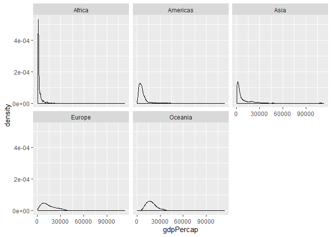
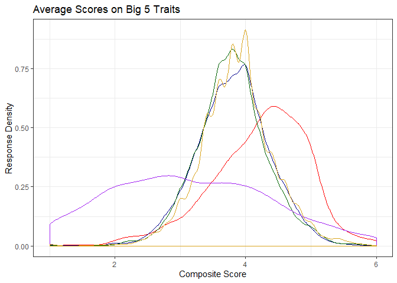
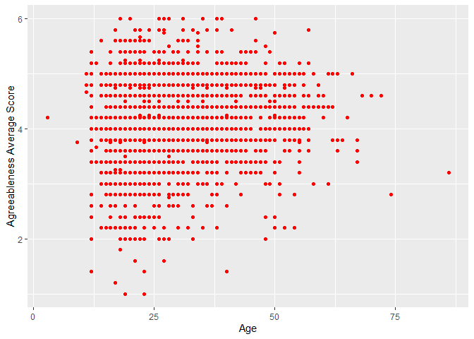
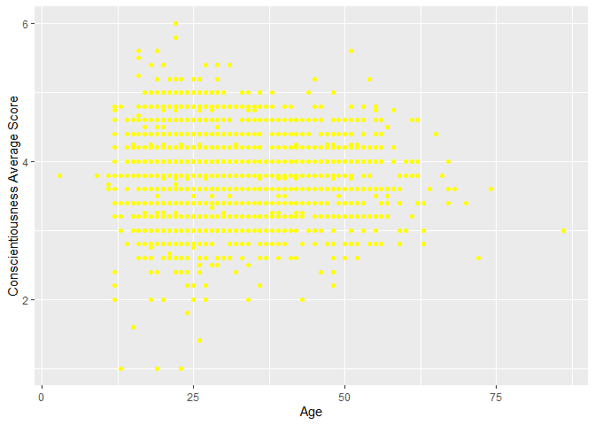
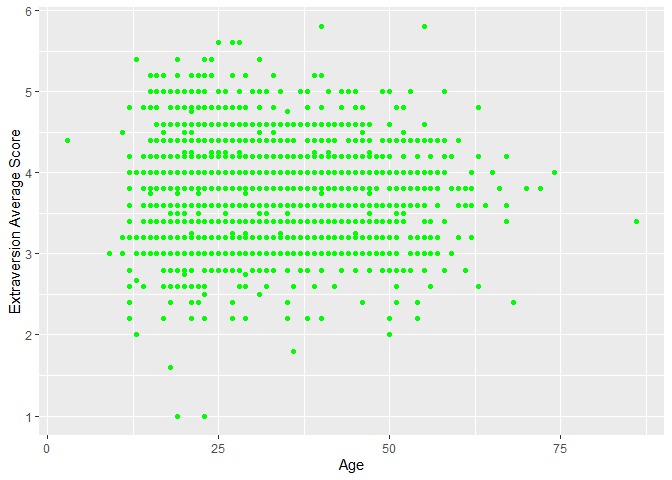
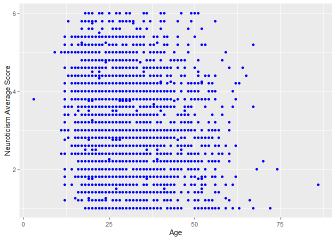
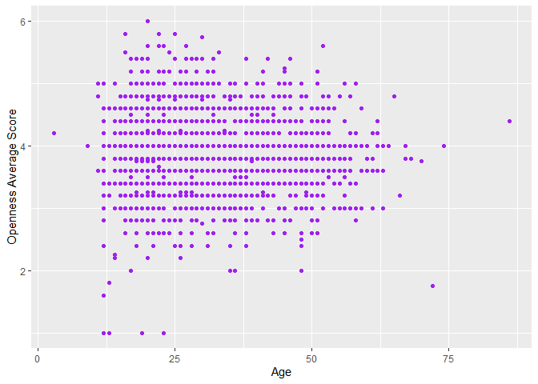

__Due February 17, 2020 at 23:59__


## Overview

The goal is to manipulate and explore a dataset with the `dplyr` package, 
complemented by visualizations made with `ggplot2`. You can think of this as a 
deeper version of Homework 02.

## Assignment

Pick _*three*_ of the tasks below, and, for each selected task, produce: 

- a tibble, using `dplyr` as your data manipulation tool;
- an accompanying plot of data from the tibble, using `ggplot2` as your visualization tool; and
- some dialogue about what your tables/figures show (doesn't have to be much).
  - The idea is to structure your assignment like it's an actual report someone
    might read.

---

### Task Option 3

Work with `gapminder`. Look at the spread/variability of GDP per capita within 
the continents.
  
_Tibble:_
  

continent     Minimum     Maximum       Range
----------  ---------  ----------  ----------
Africa         241.17    21951.21    21710.04
Americas      1201.64    42951.65    41750.01
Asia           331.00   113523.13   113192.13
Europe         973.53    49357.19    48383.66
Oceania      10039.60    34435.37    24395.77

_Plot:_
  
<!-- -->

<!-- Plotting GDP on a log scale might be better -->

_Dialogue:_
  
As you can see in the graphs above, every continent has a right-tailed distribution of GDP per capita.  Although most continents have a range across the years between 20,000 and 50,000, Asia has the greatest spread with a range over 113,000.

  
### Task Option 7

Work with `psych::bfi`. Compute composite scores for the five Big Five scores, 
including both person-mean scores and person-sd scores. Describe the 
distributions of the different personality variables.
 
_Tibble:_

```r
composite_bfi<-psych::bfi %>% 
  rownames_to_column(var = "id") %>% 
  as_tibble() %>%
  group_by(id) %>% # rowwise() will also work
  mutate(A_mean = mean(c(A1, A2, A3, A4, A5),na.rm = TRUE), 
         A_sd = sd(c(A1, A2, A3, A4, A5),na.rm = TRUE), 
         C_mean = mean(c(C1, C2, C3, C4, C5),na.rm = TRUE), 
         C_sd = sd(c(C1, C2, C3, C4, C5),na.rm = TRUE), 
         E_mean = mean(c(E1, E2, E3, E4, E5),na.rm = TRUE), 
         E_sd = sd(c(E1, E2, E3, E4, E5),na.rm = TRUE), 
         N_mean = mean(c(N1, N2, N3, N4, N5),na.rm = TRUE), 
         N_sd = sd(c(N1, N2, N3, N4, N5),na.rm = TRUE), 
         O_mean = mean(c(O1, O2, O3, O4, O5),na.rm = TRUE), 
         O_sd = sd(c(O1, O2, O3, O4, O5),na.rm = TRUE)) %>% # Best to break this up into multiple lines like I did here.
  ungroup() %>% 
  select(id,gender,education,age,A_mean,A_sd,C_mean,C_sd,E_mean,E_sd,N_mean,N_sd,O_mean,O_sd) %>% 
  print()
```

```
## # A tibble: 2,800 x 14
##    id    gender education   age A_mean  A_sd C_mean  C_sd E_mean  E_sd N_mean
##    <chr>  <int>     <int> <int>  <dbl> <dbl>  <dbl> <dbl>  <dbl> <dbl>  <dbl>
##  1 61617      1        NA    16    3.4 0.894    3.2 0.837   3.4  0.548    2.8
##  2 61618      2        NA    18    3.6 1.52     4   0.707   3    2.12     3.8
##  3 61620      2        NA    17    4.4 0.548    4   1.22    3.8  1.10     3.6
##  4 61621      2        NA    17    4.8 0.837    4.2 0.837   4    0.707    2.8
##  5 61622      1        NA    17    3.4 1.14     3.6 1.14    3.6  1.52     3.2
##  6 61623      2         3    21    5.6 0.548    4.4 2.30    4    2.35     3  
##  7 61624      1        NA    18    4   1.41     3.6 1.14    4.2  0.837    1.4
##  8 61629      1         2    19    2.8 1.79     3   1       3.2  1.92     4.2
##  9 61630      1         1    19    3.8 1.30     4.8 1.30    3.75 0.957    3.6
## 10 61633      2        NA    17    4.8 1.64     4   2.35    3.6  1.52     4.2
## # ... with 2,790 more rows, and 3 more variables: N_sd <dbl>, O_mean <dbl>,
## #   O_sd <dbl>
```

_Plot:_
<!-- -->

_Dialogue:_
  
Although individuals' average scores of three of the Big 5 traits (Openness, Extraversion, and Conscientiousness) have similar peaks and ranges, the average scores for Neuroticism form a much flatter distribution.
  
### Task Option 9

Work with `psych::bfi`. Using the composite scores from Task 7, explore how age
is related to the different personality variables. Does personality appear to 
change for different ages?
  
_Tibble:_
  

```
## # A tibble: 2,800 x 12
##    id      age A_mean  A_sd C_mean  C_sd E_mean  E_sd N_mean  N_sd O_mean  O_sd
##    <chr> <int>  <dbl> <dbl>  <dbl> <dbl>  <dbl> <dbl>  <dbl> <dbl>  <dbl> <dbl>
##  1 61617    16    3.4 0.894    3.2 0.837   3.4  0.548    2.8 0.837    3.8 1.30 
##  2 61618    18    3.6 1.52     4   0.707   3    2.12     3.8 1.10     3.2 0.837
##  3 61620    17    4.4 0.548    4   1.22    3.8  1.10     3.6 1.14     3.6 1.52 
##  4 61621    17    4.8 0.837    4.2 0.837   4    0.707    2.8 1.64     3.6 0.894
##  5 61622    17    3.4 1.14     3.6 1.14    3.6  1.52     3.2 0.837    3.2 0.447
##  6 61623    21    5.6 0.548    4.4 2.30    4    2.35     3   1.22     3.8 1.92 
##  7 61624    18    4   1.41     3.6 1.14    4.2  0.837    1.4 0.548    3.8 2.17 
##  8 61629    19    2.8 1.79     3   1       3.2  1.92     4.2 1.79     3.4 1.14 
##  9 61630    19    3.8 1.30     4.8 1.30    3.75 0.957    3.6 1.34     5   2.24 
## 10 61633    17    4.8 1.64     4   2.35    3.6  1.52     4.2 1.30     3.6 1.95 
## # ... with 2,790 more rows
```
 
_Plot:_
 
<!-- --><!-- --><!-- --><!-- --><!-- -->

_Dialogue:_
  
As can be seen in the plots above, age is uncorrelated with average score on any of the Big 5 personality traits.
  
## Optional Exercise (2%)

Get a table and figure to show side-by-side. 
[This gist](https://gist.github.com/jennybc/e9e9aba6ba18c72cec26) might get you 
started.
