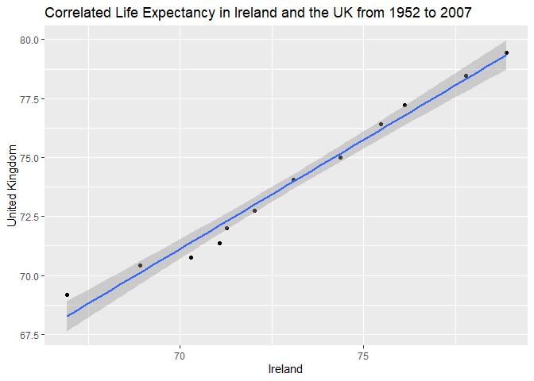

## Objective

The goal of this homework is to solidify your data wrangling skills by working 
some realistic problems in the grey area between data aggregation and data 
reshaping.

Load required packages:

```r
suppressPackageStartupMessages(library(tidyverse))
suppressPackageStartupMessages(library(gapminder))
```

## Exercise 1: Univariate Data Reshaping (30%)

### Univariate Option 1

_You are expected to use `pivot_wider()` and `pivot_longer()` for reshaping, and `ggplot2` for the plot_
  
_1. Make a tibble with one row per year, and columns for life expectancy for two or more countries_

Life Expectancy for Ireland and the UK from 1952 to 2007

```r
ex1 <- gapminder %>% 
   filter(country %in% c('Ireland', 'United Kingdom')) %>% 
   pivot_wider(id_cols = year, names_from = country, values_from = lifeExp) %>%
   print
```

```
## # A tibble: 12 x 3
##     year Ireland `United Kingdom`
##    <int>   <dbl>            <dbl>
##  1  1952    66.9             69.2
##  2  1957    68.9             70.4
##  3  1962    70.3             70.8
##  4  1967    71.1             71.4
##  5  1972    71.3             72.0
##  6  1977    72.0             72.8
##  7  1982    73.1             74.0
##  8  1987    74.4             75.0
##  9  1992    75.5             76.4
## 10  1997    76.1             77.2
## 11  2002    77.8             78.5
## 12  2007    78.9             79.4
```
_2. Take advantage of this new data shape to scatterplot life expectancy for one country against that of another._


```r
ex1 %>% 
   ggplot(aes(Ireland,`United Kingdom`)) +
   geom_point() +
   geom_smooth(method = 'lm') +
   ggtitle("Correlated Life Expectancy in Ireland and the UK from 1952 to 2007")
```

```
## `geom_smooth()` using formula 'y ~ x'
```

<!-- -->

_3. Re-lengthen the data._

```r
ex1 %>% 
   pivot_longer(cols = c('Ireland', 'United Kingdom'), names_to = 'country', values_to = 'life expectancy') %>% 
   DT::datatable()
```

<!--html_preserve--><div id="htmlwidget-b576b66d5fb5ebbb9220" style="width:100%;height:auto;" class="datatables html-widget"></div>
<script type="application/json" data-for="htmlwidget-b576b66d5fb5ebbb9220">{"x":{"filter":"none","data":[["1","2","3","4","5","6","7","8","9","10","11","12","13","14","15","16","17","18","19","20","21","22","23","24"],[1952,1952,1957,1957,1962,1962,1967,1967,1972,1972,1977,1977,1982,1982,1987,1987,1992,1992,1997,1997,2002,2002,2007,2007],["Ireland","United Kingdom","Ireland","United Kingdom","Ireland","United Kingdom","Ireland","United Kingdom","Ireland","United Kingdom","Ireland","United Kingdom","Ireland","United Kingdom","Ireland","United Kingdom","Ireland","United Kingdom","Ireland","United Kingdom","Ireland","United Kingdom","Ireland","United Kingdom"],[66.91,69.18,68.9,70.42,70.29,70.76,71.08,71.36,71.28,72.01,72.03,72.76,73.1,74.04,74.36,75.007,75.467,76.42,76.122,77.218,77.783,78.471,78.885,79.425]],"container":"<table class=\"display\">\n  <thead>\n    <tr>\n      <th> <\/th>\n      <th>year<\/th>\n      <th>country<\/th>\n      <th>life expectancy<\/th>\n    <\/tr>\n  <\/thead>\n<\/table>","options":{"columnDefs":[{"className":"dt-right","targets":[1,3]},{"orderable":false,"targets":0}],"order":[],"autoWidth":false,"orderClasses":false}},"evals":[],"jsHooks":[]}</script><!--/html_preserve-->

## Exercise 2: Multivariate Data Reshaping (30%)

_You are expected to use `pivot_wider()` and `pivot_longer()` for reshaping._

### Multivariate Option 1

*1. Make a tibble with _one row per year_, and _columns_ for life expectancy _and_ GDP per capita for two or more countries.*

Life Expectancy and GDP for Ireland and the UK from 1952 to 2007

```r
ex2 <- gapminder %>% 
   filter(country %in% c('Ireland', 'United Kingdom')) %>% 
   pivot_wider(id_cols = year, names_from = country, values_from = c(lifeExp,gdpPercap)) %>%
   print
```

```
## # A tibble: 12 x 5
##     year lifeExp_Ireland `lifeExp_United Ki~ gdpPercap_Irela~ `gdpPercap_United~
##    <int>           <dbl>               <dbl>            <dbl>              <dbl>
##  1  1952            66.9                69.2            5210.              9980.
##  2  1957            68.9                70.4            5599.             11283.
##  3  1962            70.3                70.8            6632.             12477.
##  4  1967            71.1                71.4            7656.             14143.
##  5  1972            71.3                72.0            9531.             15895.
##  6  1977            72.0                72.8           11151.             17429.
##  7  1982            73.1                74.0           12618.             18232.
##  8  1987            74.4                75.0           13873.             21665.
##  9  1992            75.5                76.4           17559.             22705.
## 10  1997            76.1                77.2           24522.             26075.
## 11  2002            77.8                78.5           34077.             29479.
## 12  2007            78.9                79.4           40676.             33203.
```

_2. Print this table in a pretty format, using either `knitr::kable()` or `DT::datatable()` depending on the number of rows of data._


```r
DT::datatable(ex2)
```

<!--html_preserve--><div id="htmlwidget-2ed7d1aa57294a0dd80a" style="width:100%;height:auto;" class="datatables html-widget"></div>
<script type="application/json" data-for="htmlwidget-2ed7d1aa57294a0dd80a">{"x":{"filter":"none","data":[["1","2","3","4","5","6","7","8","9","10","11","12"],[1952,1957,1962,1967,1972,1977,1982,1987,1992,1997,2002,2007],[66.91,68.9,70.29,71.08,71.28,72.03,73.1,74.36,75.467,76.122,77.783,78.885],[69.18,70.42,70.76,71.36,72.01,72.76,74.04,75.007,76.42,77.218,78.471,79.425],[5210.280328,5599.077872,6631.597314,7655.568963,9530.772896,11150.98113,12618.32141,13872.86652,17558.81555,24521.94713,34077.04939,40675.99635],[9979.508487,11283.17795,12477.17707,14142.85089,15895.11641,17428.74846,18232.42452,21664.78767,22705.09254,26074.53136,29478.99919,33203.26128]],"container":"<table class=\"display\">\n  <thead>\n    <tr>\n      <th> <\/th>\n      <th>year<\/th>\n      <th>lifeExp_Ireland<\/th>\n      <th>lifeExp_United Kingdom<\/th>\n      <th>gdpPercap_Ireland<\/th>\n      <th>gdpPercap_United Kingdom<\/th>\n    <\/tr>\n  <\/thead>\n<\/table>","options":{"columnDefs":[{"className":"dt-right","targets":[1,2,3,4,5]},{"orderable":false,"targets":0}],"order":[],"autoWidth":false,"orderClasses":false}},"evals":[],"jsHooks":[]}</script><!--/html_preserve-->

_3. Re-lengthen the data._

```r
ex2 %>% 
   pivot_longer(cols = -year, names_to = c(".value","country"), names_sep = '_') %>% 
   DT::datatable()
```

<!--html_preserve--><div id="htmlwidget-12fdc3c70ac787b3db02" style="width:100%;height:auto;" class="datatables html-widget"></div>
<script type="application/json" data-for="htmlwidget-12fdc3c70ac787b3db02">{"x":{"filter":"none","data":[["1","2","3","4","5","6","7","8","9","10","11","12","13","14","15","16","17","18","19","20","21","22","23","24"],[1952,1952,1957,1957,1962,1962,1967,1967,1972,1972,1977,1977,1982,1982,1987,1987,1992,1992,1997,1997,2002,2002,2007,2007],["Ireland","United Kingdom","Ireland","United Kingdom","Ireland","United Kingdom","Ireland","United Kingdom","Ireland","United Kingdom","Ireland","United Kingdom","Ireland","United Kingdom","Ireland","United Kingdom","Ireland","United Kingdom","Ireland","United Kingdom","Ireland","United Kingdom","Ireland","United Kingdom"],[66.91,69.18,68.9,70.42,70.29,70.76,71.08,71.36,71.28,72.01,72.03,72.76,73.1,74.04,74.36,75.007,75.467,76.42,76.122,77.218,77.783,78.471,78.885,79.425],[5210.280328,9979.508487,5599.077872,11283.17795,6631.597314,12477.17707,7655.568963,14142.85089,9530.772896,15895.11641,11150.98113,17428.74846,12618.32141,18232.42452,13872.86652,21664.78767,17558.81555,22705.09254,24521.94713,26074.53136,34077.04939,29478.99919,40675.99635,33203.26128]],"container":"<table class=\"display\">\n  <thead>\n    <tr>\n      <th> <\/th>\n      <th>year<\/th>\n      <th>country<\/th>\n      <th>lifeExp<\/th>\n      <th>gdpPercap<\/th>\n    <\/tr>\n  <\/thead>\n<\/table>","options":{"columnDefs":[{"className":"dt-right","targets":[1,3,4]},{"orderable":false,"targets":0}],"order":[],"autoWidth":false,"orderClasses":false}},"evals":[],"jsHooks":[]}</script><!--/html_preserve-->


## Exercise 3: Table Joins (30%)

_Read in the made-up wedding guestlist and email addresses using the following lines.  Then, complete the following tasks using the tidyverse (`tidyr`, `dplyr`, ...)._


```r
guest <- read_csv("https://raw.githubusercontent.com/USF-Psych-DataSci/Classroom/master/data/wedding/attend.csv")
```

```
## Parsed with column specification:
## cols(
##   party = col_double(),
##   name = col_character(),
##   meal_wedding = col_character(),
##   meal_brunch = col_character(),
##   attendance_wedding = col_character(),
##   attendance_brunch = col_character(),
##   attendance_golf = col_character()
## )
```

```r
email <- read_csv("https://raw.githubusercontent.com/USF-Psych-DataSci/Classroom/master/data/wedding/emails.csv")
```

```
## Parsed with column specification:
## cols(
##   guest = col_character(),
##   email = col_character()
## )
```


_1.For each guest in the guestlist (`guest` tibble), add a column for email address, which can be found in the `email` tibble._

List each person individually by name in the 'email' tibble:

```r
email_sep <- email %>% 
   separate_rows(guest, sep = ", ") %>% 
   rename(name = guest)
```

Combine the two tibbles:

```r
guest %>% 
   left_join(email_sep, by = 'name') %>% 
   DT::datatable()
```

<!--html_preserve--><div id="htmlwidget-68978446ecc57183c335" style="width:100%;height:auto;" class="datatables html-widget"></div>
<script type="application/json" data-for="htmlwidget-68978446ecc57183c335">{"x":{"filter":"none","data":[["1","2","3","4","5","6","7","8","9","10","11","12","13","14","15","16","17","18","19","20","21","22","23","24","25","26","27","28","29","30"],[1,1,1,1,2,2,3,4,5,5,5,6,6,7,7,8,9,10,11,12,12,12,12,12,13,13,14,14,15,15],["Sommer Medrano","Phillip Medrano","Blanka Medrano","Emaan Medrano","Blair Park","Nigel Webb","Sinead English","Ayra Marks","Atlanta Connolly","Denzel Connolly","Chanelle Shah","Jolene Welsh","Hayley Booker","Amayah Sanford","Erika Foley","Ciaron Acosta","Diana Stuart","Cosmo Dunkley","Cai Mcdaniel","Daisy-May Caldwell","Martin Caldwell","Violet Caldwell","Nazifa Caldwell","Eric Caldwell","Rosanna Bird","Kurtis Frost","Huma Stokes","Samuel Rutledge","Eddison Collier","Stewart Nicholls"],["PENDING","vegetarian","chicken","PENDING","chicken",null,"PENDING","vegetarian","PENDING","fish","chicken",null,"vegetarian",null,"PENDING","PENDING","vegetarian","PENDING","fish","chicken","PENDING","PENDING","chicken","chicken","vegetarian","PENDING",null,"chicken","PENDING","chicken"],["PENDING","Menu C","Menu A","PENDING","Menu C",null,"PENDING","Menu B","PENDING","Menu B","Menu C",null,"Menu C","PENDING","PENDING","Menu A","Menu C","PENDING","Menu C","Menu B","PENDING","PENDING","PENDING","Menu B","Menu C","PENDING",null,"Menu C","PENDING","Menu B"],["PENDING","CONFIRMED","CONFIRMED","PENDING","CONFIRMED","CANCELLED","PENDING","PENDING","PENDING","CONFIRMED","CONFIRMED","CANCELLED","CONFIRMED","CANCELLED","PENDING","PENDING","CONFIRMED","PENDING","CONFIRMED","CONFIRMED","PENDING","PENDING","PENDING","CONFIRMED","CONFIRMED","PENDING","CANCELLED","CONFIRMED","PENDING","CONFIRMED"],["PENDING","CONFIRMED","CONFIRMED","PENDING","CONFIRMED","CANCELLED","PENDING","PENDING","PENDING","CONFIRMED","CONFIRMED","CANCELLED","CONFIRMED","PENDING","PENDING","PENDING","CONFIRMED","PENDING","CONFIRMED","CONFIRMED","PENDING","PENDING","PENDING","CONFIRMED","CONFIRMED","PENDING","CANCELLED","CONFIRMED","PENDING","CONFIRMED"],["PENDING","CONFIRMED","CONFIRMED","PENDING","CONFIRMED","CANCELLED","PENDING","PENDING","PENDING","CONFIRMED","CONFIRMED","CANCELLED","CONFIRMED","PENDING","PENDING","PENDING","CONFIRMED","PENDING","CONFIRMED","CONFIRMED","PENDING","PENDING","PENDING","CONFIRMED","CONFIRMED","PENDING","CANCELLED","CONFIRMED","PENDING","CONFIRMED"],["sommm@gmail.com","sommm@gmail.com","sommm@gmail.com","sommm@gmail.com","bpark@gmail.com","bpark@gmail.com","singlish@hotmail.ca","marksa42@gmail.com",null,null,null,"jw1987@hotmail.com","jw1987@hotmail.com","erikaaaaaa@gmail.com","erikaaaaaa@gmail.com","shining_ciaron@gmail.com","doodledianastu@gmail.com",null,null,"caldwellfamily5212@gmail.com","caldwellfamily5212@gmail.com","caldwellfamily5212@gmail.com","caldwellfamily5212@gmail.com","caldwellfamily5212@gmail.com","rosy1987b@gmail.com","rosy1987b@gmail.com","humastokes@gmail.com","humastokes@gmail.com","eddison.collier@gmail.com","eddison.collier@gmail.com"]],"container":"<table class=\"display\">\n  <thead>\n    <tr>\n      <th> <\/th>\n      <th>party<\/th>\n      <th>name<\/th>\n      <th>meal_wedding<\/th>\n      <th>meal_brunch<\/th>\n      <th>attendance_wedding<\/th>\n      <th>attendance_brunch<\/th>\n      <th>attendance_golf<\/th>\n      <th>email<\/th>\n    <\/tr>\n  <\/thead>\n<\/table>","options":{"columnDefs":[{"className":"dt-right","targets":1},{"orderable":false,"targets":0}],"order":[],"autoWidth":false,"orderClasses":false}},"evals":[],"jsHooks":[]}</script><!--/html_preserve-->

_2.Who do we have emails for, yet are not on the guestlist?_

```r
email_sep %>% 
   anti_join(guest, by = 'name') %>% 
   knitr::kable()
```


name              email                           
----------------  --------------------------------
Turner Jones      tjjones12@hotmail.ca            
Albert Marshall   themarshallfamily1234@gmail.com 
Vivian Marshall   themarshallfamily1234@gmail.com 


_3.Make a guestlist that includes everyone we have emails for (in addition to those on the original guestlist)._

```r
guest %>% 
   full_join(email_sep, by = 'name') %>% 
   DT::datatable()
```

<!--html_preserve--><div id="htmlwidget-7fa6ab93c9195561922f" style="width:100%;height:auto;" class="datatables html-widget"></div>
<script type="application/json" data-for="htmlwidget-7fa6ab93c9195561922f">{"x":{"filter":"none","data":[["1","2","3","4","5","6","7","8","9","10","11","12","13","14","15","16","17","18","19","20","21","22","23","24","25","26","27","28","29","30","31","32","33"],[1,1,1,1,2,2,3,4,5,5,5,6,6,7,7,8,9,10,11,12,12,12,12,12,13,13,14,14,15,15,null,null,null],["Sommer Medrano","Phillip Medrano","Blanka Medrano","Emaan Medrano","Blair Park","Nigel Webb","Sinead English","Ayra Marks","Atlanta Connolly","Denzel Connolly","Chanelle Shah","Jolene Welsh","Hayley Booker","Amayah Sanford","Erika Foley","Ciaron Acosta","Diana Stuart","Cosmo Dunkley","Cai Mcdaniel","Daisy-May Caldwell","Martin Caldwell","Violet Caldwell","Nazifa Caldwell","Eric Caldwell","Rosanna Bird","Kurtis Frost","Huma Stokes","Samuel Rutledge","Eddison Collier","Stewart Nicholls","Turner Jones","Albert Marshall","Vivian Marshall"],["PENDING","vegetarian","chicken","PENDING","chicken",null,"PENDING","vegetarian","PENDING","fish","chicken",null,"vegetarian",null,"PENDING","PENDING","vegetarian","PENDING","fish","chicken","PENDING","PENDING","chicken","chicken","vegetarian","PENDING",null,"chicken","PENDING","chicken",null,null,null],["PENDING","Menu C","Menu A","PENDING","Menu C",null,"PENDING","Menu B","PENDING","Menu B","Menu C",null,"Menu C","PENDING","PENDING","Menu A","Menu C","PENDING","Menu C","Menu B","PENDING","PENDING","PENDING","Menu B","Menu C","PENDING",null,"Menu C","PENDING","Menu B",null,null,null],["PENDING","CONFIRMED","CONFIRMED","PENDING","CONFIRMED","CANCELLED","PENDING","PENDING","PENDING","CONFIRMED","CONFIRMED","CANCELLED","CONFIRMED","CANCELLED","PENDING","PENDING","CONFIRMED","PENDING","CONFIRMED","CONFIRMED","PENDING","PENDING","PENDING","CONFIRMED","CONFIRMED","PENDING","CANCELLED","CONFIRMED","PENDING","CONFIRMED",null,null,null],["PENDING","CONFIRMED","CONFIRMED","PENDING","CONFIRMED","CANCELLED","PENDING","PENDING","PENDING","CONFIRMED","CONFIRMED","CANCELLED","CONFIRMED","PENDING","PENDING","PENDING","CONFIRMED","PENDING","CONFIRMED","CONFIRMED","PENDING","PENDING","PENDING","CONFIRMED","CONFIRMED","PENDING","CANCELLED","CONFIRMED","PENDING","CONFIRMED",null,null,null],["PENDING","CONFIRMED","CONFIRMED","PENDING","CONFIRMED","CANCELLED","PENDING","PENDING","PENDING","CONFIRMED","CONFIRMED","CANCELLED","CONFIRMED","PENDING","PENDING","PENDING","CONFIRMED","PENDING","CONFIRMED","CONFIRMED","PENDING","PENDING","PENDING","CONFIRMED","CONFIRMED","PENDING","CANCELLED","CONFIRMED","PENDING","CONFIRMED",null,null,null],["sommm@gmail.com","sommm@gmail.com","sommm@gmail.com","sommm@gmail.com","bpark@gmail.com","bpark@gmail.com","singlish@hotmail.ca","marksa42@gmail.com",null,null,null,"jw1987@hotmail.com","jw1987@hotmail.com","erikaaaaaa@gmail.com","erikaaaaaa@gmail.com","shining_ciaron@gmail.com","doodledianastu@gmail.com",null,null,"caldwellfamily5212@gmail.com","caldwellfamily5212@gmail.com","caldwellfamily5212@gmail.com","caldwellfamily5212@gmail.com","caldwellfamily5212@gmail.com","rosy1987b@gmail.com","rosy1987b@gmail.com","humastokes@gmail.com","humastokes@gmail.com","eddison.collier@gmail.com","eddison.collier@gmail.com","tjjones12@hotmail.ca","themarshallfamily1234@gmail.com","themarshallfamily1234@gmail.com"]],"container":"<table class=\"display\">\n  <thead>\n    <tr>\n      <th> <\/th>\n      <th>party<\/th>\n      <th>name<\/th>\n      <th>meal_wedding<\/th>\n      <th>meal_brunch<\/th>\n      <th>attendance_wedding<\/th>\n      <th>attendance_brunch<\/th>\n      <th>attendance_golf<\/th>\n      <th>email<\/th>\n    <\/tr>\n  <\/thead>\n<\/table>","options":{"columnDefs":[{"className":"dt-right","targets":1},{"orderable":false,"targets":0}],"order":[],"autoWidth":false,"orderClasses":false}},"evals":[],"jsHooks":[]}</script><!--/html_preserve-->

```r
#note that this list is not saved (since this is the last step in the assignment).  In a practical situation, it would likely be assigned to a new variable
```
